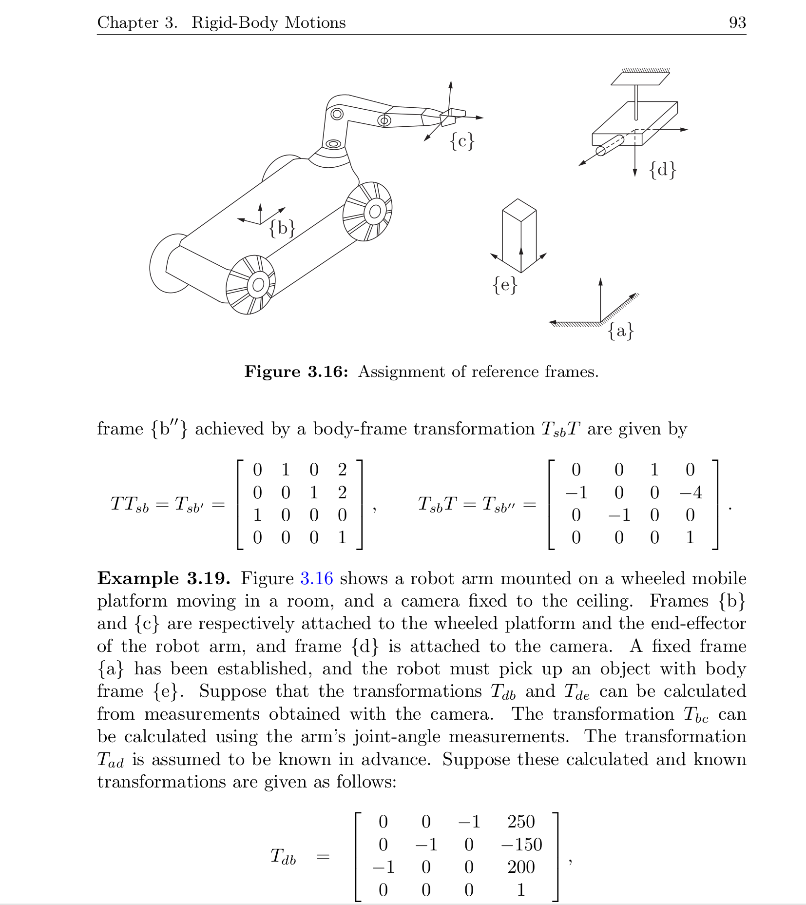

# Robot Motion Visualizer

I was taking a course (Modern Robotics by Kelvin Lynch) on robotics mathematics, a time came where I was struggling to visualize the mathematics so In put this software together. Robot Motion Visualizer is a C++ Qt desktop app for visualizing rigid-body transforms in SE(3). You can statically visualize any translation and rotation around any axis, Euler-angle and translation controls, homogeneous tranlation matrix and quaternion editing. The best part is that you can set various tranlation and simulate the robot movement.

I actually added the simulation part because of the exercise in the course textbook (picture below). It was so interesting that I wanted to see that the calculation works.

## Features

1. Interactive transform controls for:
	 Rotation as Euler ZYX angles (roll, pitch, yaw)
	 Translation along X, Y, Z
2. Transform representations in:
     Angles via the slider
	 4x4 homogeneous transformation matrix
	 Quaternion [w, x, y, z]
3. Animation tools:
	 Point movement simulation

## How to Build And Run

I wrote the app in C++ Qt so you might need to have some familarisation with Qt. If you have Qt Creator installed, you can directly launch the project in Qt Creator.

I tried and saw it can be launch in VS Code also but Qt has to be installed.

### VS Code

1. Ensure Qt development packages are installed and available to CMake.
2. Configure and build:

	 cmake -S . -B build
	 cmake --build build -j

3. Run:

	 ./build/RobotMotionVisualizer

If CMake cannot locate Qt, point it to your Qt installation, for example:

cmake -S . -B build -DCMAKE_PREFIX_PATH=/path/to/Qt/6.x.x/gcc_64

### Qt Creator

Open CMakeLists.txt in Qt Creator, select a Qt kit, then Build and Run.

## Notes

- Euler convention in this project and in the textbook used is ZYX composition (yaw -> pitch -> roll).
- Waypoint interpolation uses linear translation interpolation and quaternion-based rotational interpolation.
